<div id="top" align="center">
</div>
<!-- PROJECT LOGO -->
<div align="center">
<h1 align="center">Statistical Method Project</h1>
  <h3 align="center">
    Applying statistics in exploring and predicting Car Price
    <br />
    <br />
    <a href="https://github.com/haingocnguyen/Used-Car-Price-Prediction/issues">Report Bug</a>
    ·
    <a href="https://github.com/haingocnguyen/Used-Car-Price-Prediction/issues">Request Feature</a>
  </h3>

[![Contributors][contributors-shield]][contributors-url]
[![Forks][forks-shield]][forks-url]
[![Issues][issues-shield]][issues-url]

</div>

# ABOUT

## 1. The team behind it

| No. |       Full Name        | Student's ID |              Email               |                  Github account                   |                               Roles                                | Contribution |
| :-: | :--------------------: | :----------: | :------------------------------: | :-----------------------------------------------: | :----------------------------------------------------------------: | :----------: |
|  1  |  Nguyen Hai Ngoc   | ITDSIU21057  | ITDSIU21057@student.hcmiu.edu.vn |     [haingocnguyen](https://github.com/haingocnguyen)     |   **TEAM LEADER**  with EDA and report constructing   |     20%      |
|  2  |   Phan Quoc Anh    | ITDSIU21001  | ITDSIU21001@student.hcmiu.edu.vn |    [quocanhphan](https://github.com/quocanhphan)    |              Quantitative data processing              |     20%      |
|  3  | Hoang Tuan Kiet | ITDSIU21055  | ITDSIU21057@student.hcmiu.edu.vn |     [meiskiet](https://github.com/meiskiet)     | Quantitative data processing |     20%      |
|  4  |    Nguyen Trinh Phuong Nguyen     | IELSIU21337  | IELSIU21337@student.hcmiu.edu.vn |      [trngphng1311](https://github.com/trngphng1311)      |          Categorical data processing           |     20%      |
|  5  |    Nguyen Trong Tien     | IELSIU21386  | IELSIU21386@student.hcmiu.edu.vn | [nttien2963](https://github.com/nttien2963) | Data preprocessing and slides designing |     20%      |

## 2. The project we are working on

The project investigates car's engine features relationship to car price. We try to explore data and build regression model as well as using OLS summary to evaluate the result.

## 3. Roadmap

- [x] Explanatory Data Analysis
- [x] Data pre-processing
- [x] Categorical Data Processing
- [x] Quantitative Data Processing
- [ ] More to come...


# METHODOLOGY 

## 1. Explanatory Data Analysis

Statistical analysis and data visualization techniques are also implemented to provide a foundation for selecting appropriate features, inform the choice of algorithms, and understand the underlying structure of the data.

## 2. Categorical Data Processing

Categorical data processing includes plotting some charts and graph, corresponding to frequency table to gain insights from the visualization. Regression is also included when printing some output of the relation between the chosen dummy variables and the response feature.

## 3. Quantitative Data Processing

Regression is applied to evaluate the relation between quantitative variables and the target, and some possible measures are selected to find out the special features of the data. Furthermore, correlation for choosing the best variables for making regression models.


# PROJECT STRUCTURE

- `data` folder: to hold the original dataset in xlsx format and dummy dataset in csv format.
- `lib` folder: contains img src for README construction.
- `src` folder: the primary source directory for the project’s code
  - `CategoricalforPlotting.ipynb`: 
  - `CategoricalforRegression.ipynb`:
  - `EDA.ipynb`:
  - `QuantitativeData.ipynb`:
- `README.md`: a document to outline and explain the project

# INSTALLATION


## Steps

1. Clone the repo
   ```sh
   git clone https://github.com/haingocnguyen/Used-Car-Price-Prediction.git
   ```
2. Open in an IDE that support Python programming and Jupyter Notebook (preferably Visual Studio Code)

3. Open `src/` and click on the IPYNB file to run the result in order of: EDA -> CategoricalforPlotting -> CategoricalforRegression -> QuantitativeData

then click on **Run All** to see the result

# RESULT

## Exploratory Data Analysis

In general, the ‘Car Price Assignment’ dataset contains some technique records about cars, with various features that may contribute to predicting price:
+ It includes 205 rows and 26 columns with no missing value by using `df.shape()` and `df.info()`
+ It includes 26 attributes with car’s identity features.
+ Main datatype: Float, Integer and Object, both numerical and binary representation included.
+ There is no duplicated row existing in the dataset. 


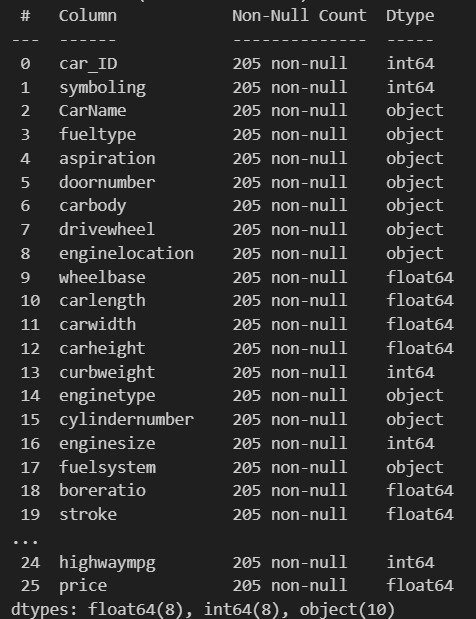


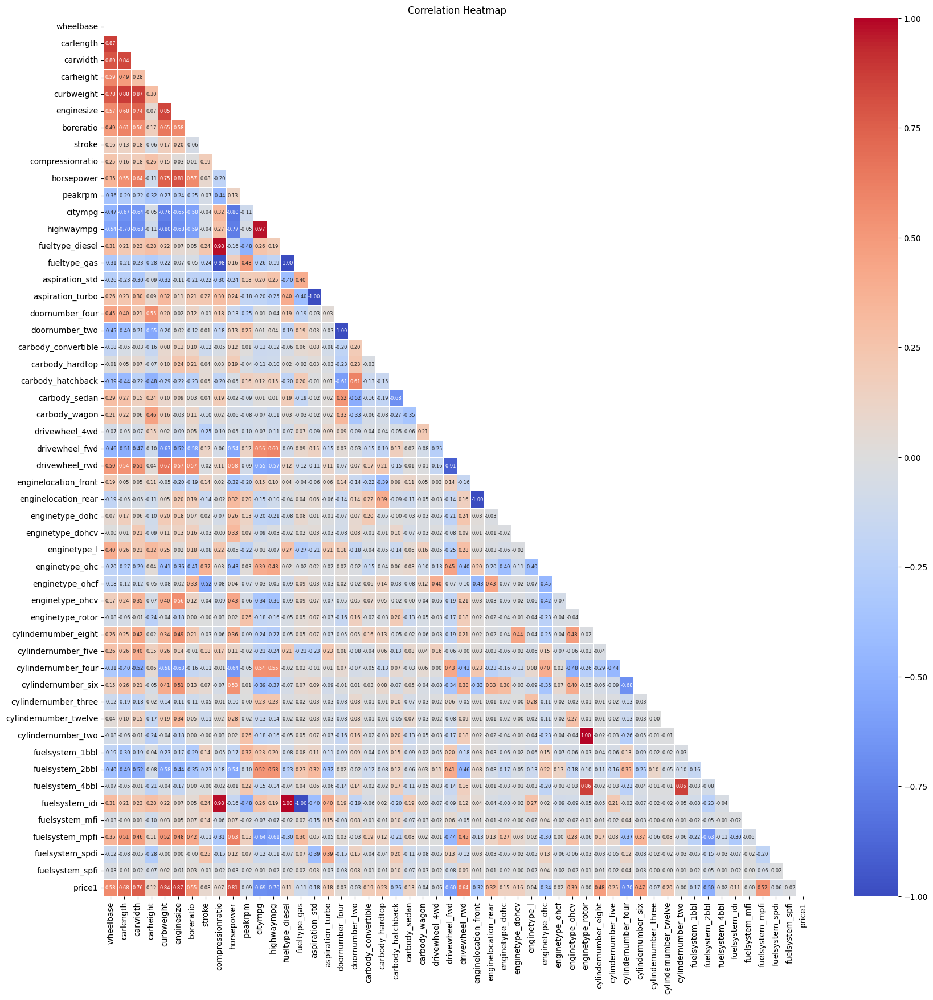

Here, we easily see that there are six attributes that has the typical correlation to the `PRICE` attributes: 'curbweight', 'enginesize', 'horsepower', 'carwidth', 'highwaympg', 'cylindernumber_four'
-	 ‘enginesize’ attributes as the most significant positive correlation with 0.87.
-	‘curbweight’ as the positive correlation with 0.84.
-	‘horsepower’ as the positive correlation with 0.81.
-	‘carwidth’ as the positive correlation values with 0.76.
-	‘highwaympg’ and ‘cylindernumber_four’ as the most significant negative correlation value with -0.70.


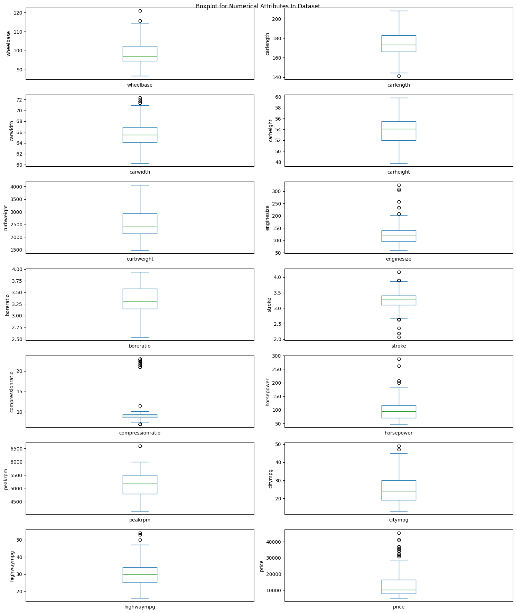

Almost outliers exist in numerical attributes, except for ‘carheight’, ‘boreratio’, and ‘curbweight’ attribute. It could come from some unknown measurements.

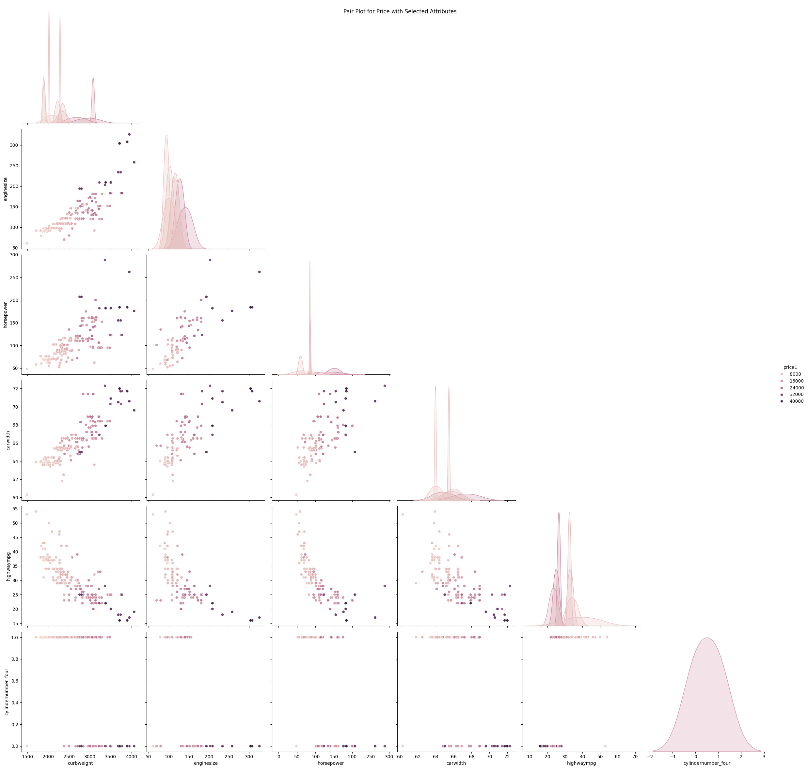

•	**Enginesize vs. Price**: There's a positive correlation, suggesting that larger engine sizes tend to be associated with higher prices.

•	**Horsepower vs. Price**: Similarly, higher horsepower is generally associated with higher prices, although there's some spread indicating variability in this relationship.

•	**Citympg and Highwaympg vs. Price**: There's an inverse relationship where higher fuel efficiency (in city or highway) tends to be associated with lower prices.

•	**Cylindernumber_four vs. Price**: This variable appears categorical, and the spread in the scatter plots can indicate price differences between cars with different numbers of cylinders.

•	The distributions show variability and potential subcategories within the data. The scatter plots reveal clusters that suggest different segments in car pricing.

Overall, these insights indicate that engine characteristics and fuel efficiency are key determinants of car prices, with distinct price differences associated with the number of cylinders.

*In conclusion, we approach the properties of the dataset with clear description:*

*•	There are 205 non-null values in all the attributes thus no missing values.*

*•	No duplicated rows.*

*•	There are many outliers existed in the dataset, such as: 'car_width', 'enginesize', 'stroke', 'compressionratio' and 'price'.*

*•	Datatype is also either 'float64' or 'int64' or 'object', all works well.*

*•	Attributes with high correlation (|r|>0.7):  'curbweight', 'enginesize', 'horsepower', 'carwidth', 'highwaympg', 'cylindernumber_four'*


## Categorical Data Processing

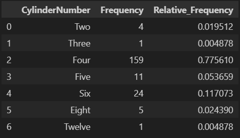

Obviously, the value ‘Four’ has the frequency of 159, the highest frequency in ‘cylindernumber’. Therefore, it take the highest relative frequency of 77.68%. We plot bar graphs for easily compare the frequency of each value:

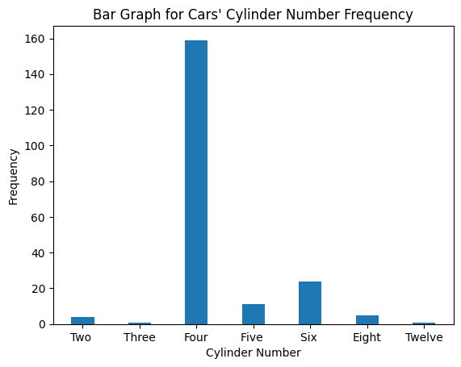

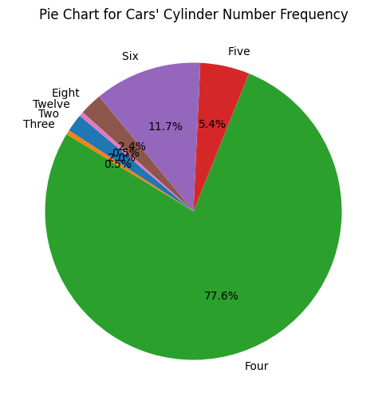

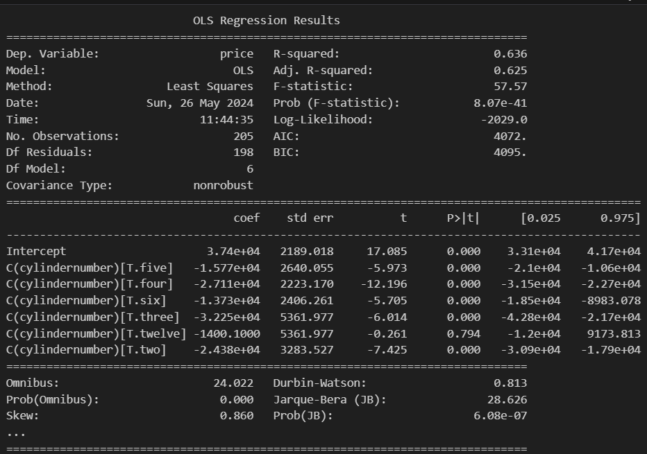

By observing the result from OLS summary, we can mark some important keys of this model:

•	R-square of 0.636 indicates that 63.6% of the variability in the car prices can be explained by the model. This is a moderate fit, suggesting that the model explains a significant portion of the variability.

•	Adj. R-squared of 0.625 is slightly lower than  the R-squared, accounts for the number of predictors in the model and still indicates a good fit.

•	The intercept with the coefficient of 3.74e+04 interprets the baseline price when all dummy variables for ‘cylindernumber’ are zero.

•	Coefficient of cylinernumber_five is -1.577e+04 means that  having ‘cylindernumber’ as five reduces the price by 15,770 units compared to the baseline.

•	Coefficient of cylinernumber_four is -2.711e+04 means that  having ‘cylindernumber’ as five reduces the price by 27,110 units compared to the baseline.

•	Coefficient of cylinernumber_six is -1.373e+04 means that  having ‘cylindernumber’ as five reduces the price by 13,730 units compared to the baseline.

•	Coefficient of cylinernumber_three is -3.225e+04 means that  having ‘cylindernumber’ as five reduces the price by 32,250 units compared to the baseline.

•	Coefficient of cylinernumber_two is -2.438e+04 means that  having ‘cylindernumber’ as five reduces the price by 24,380 units compared to the baseline.

•	Coefficient of cylinernumber_twelve is -1400.1000 means that  having ‘cylindernumber’ as five reduces the price by 1,4000 units compared to the baseline.

Therefore, we can say that cars with fewer cylinders (two, three, four) tend to have significantly lower prices compared to the baseline. The magnitude of the coefficients for these categories suggests a strong negative impact on price, particularly for cars with four or fewer cylinders. The number of cylinders in a car is a significant factor in determining its price. This information can be useful for car manufacturers and sellers in pricing strategies and for buyers in understanding the value impact of different engine configurations.


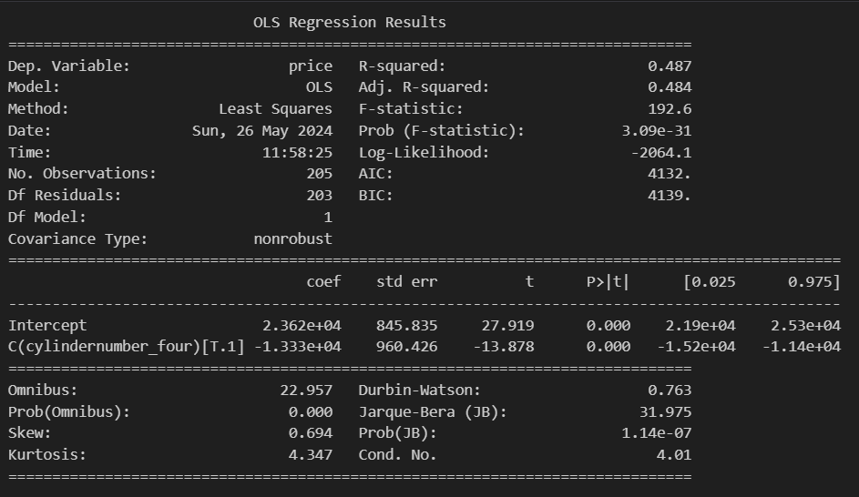

Based on the findings presented, it appears that having four cylinders has the most significant impact on the final price, possibly due to the prevalence of this value in the cylinder number attribute. However, although the R-square value for four cylinders is not exceptionally high, it's not advisable to isolate this dummy variable as the sole factor influencing the final outcome.


## Quantitative Data Processing

Initially, ‘enginesize’ has the strongest correlation with ‘price’, showing a correlation coefficient of 0.87. Therefore, we select ‘enginesize’ as the predictor variable to construct a least-squares regression model. Before proceeding with model construction, we will create some plots to examine the distribution and assess any potential outliers.

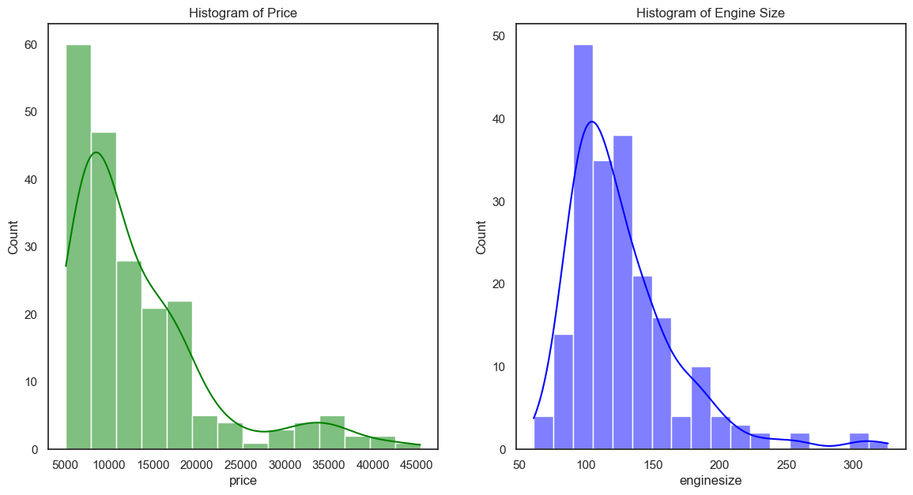

There are numerous outliers in both attributes. By applying the quartile formula to identify outlier values, we have found the following outliers:

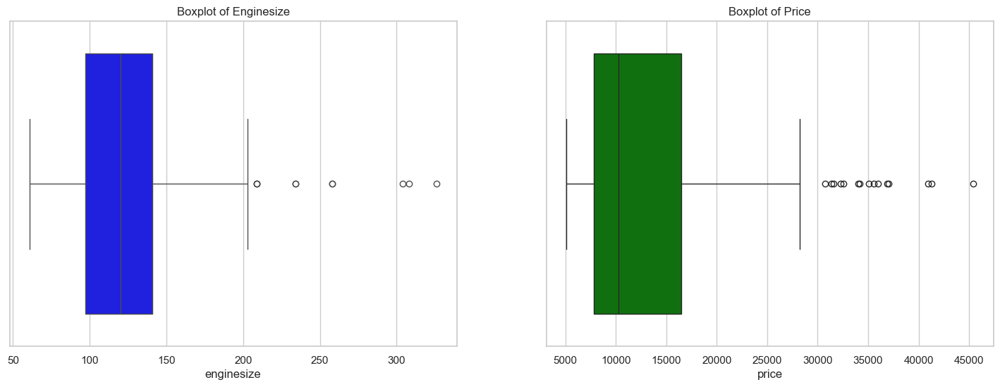

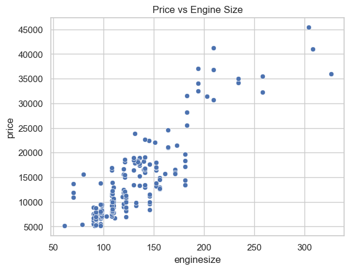

The scatter plot reveals a linear relationship between ‘enginesize’ and ‘price’, indicating a positive correlation between these two variables. To delve deeper, we will construct a least squares regression equation and interpret the results.

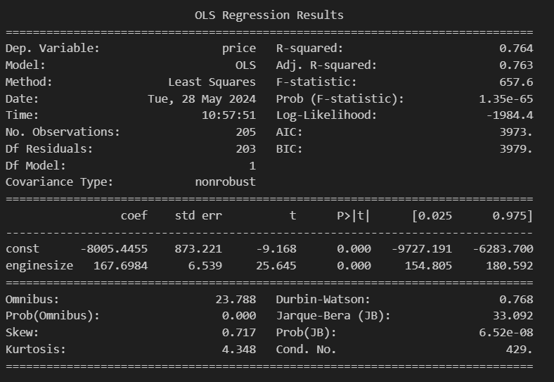

Least – squared regression function:

    Price = -8005.45 +  167.70 * enginesize


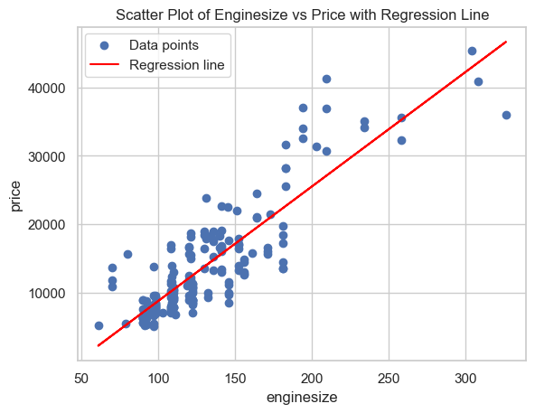

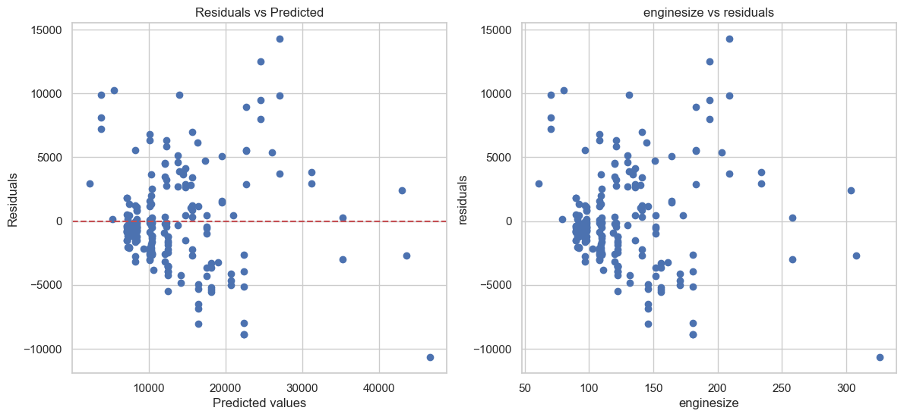

The residual plots above do not show any pattern, so a linear model is appropriate. Furthermore, the absolute value of the residuals seems to be larger when x is larger and smaller when x is smaller. This means that the predictions made using the regression equation will be less reliable when x is large because there is more variability in y (no constant variance).

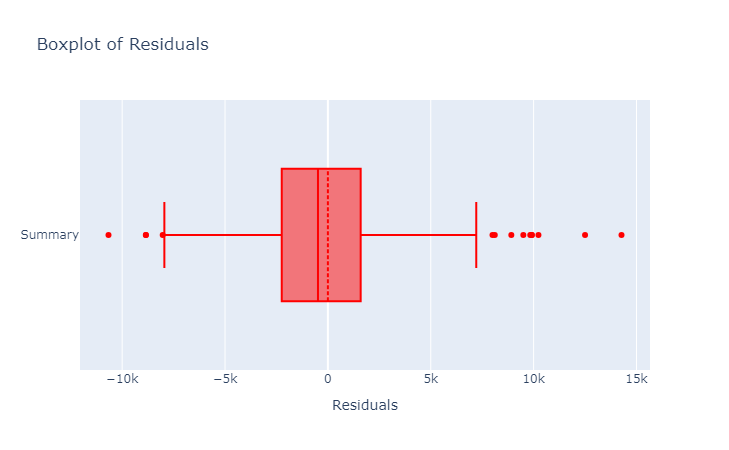

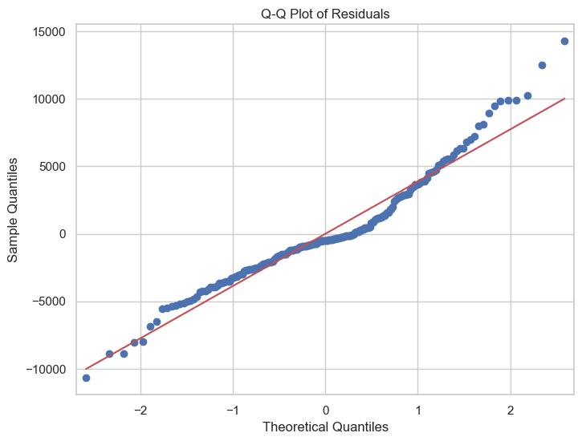

	From the Q-Q plot, we can conclude that the residuals are normally distributed.

**(and more to explore for you to contribute in our project...)**

<!-- CONTRIBUTING -->

# CONTRIBUTING

Contributions are what make the open source community such an amazing place to learn, inspire, and create. Any
contributions you make are **greatly appreciated**.

If you have a suggestion that would make this better, please fork the repo and create a pull request. You can also
simply open an issue with the tag "enhancement".
Don't forget to give the project a star! Thanks again!

1. Fork the Project
2. Create your Feature Branch (`git checkout -b feature/AmazingFeature`)
3. Commit your Changes (`git commit -m 'Add some AmazingFeature'`)
4. Push to the Branch (`git push origin feature/AmazingFeature`)
5. Open a Pull Request

<!-- CONTACT-->

# CONTACT

Nguyen Hai Ngoc by **[Email HERE](mailto:ITDSIU21057@student.hcmiu.edu.vn)**

Project Link: **[GitHub HERE](https://github.com/haingocnguyen/Used-Car-Price-Prediction/issues)**

<!-- ACKNOWLEDGMENTS -->

# ACKNOWLEDGEMENTS

We want to express our sincerest thanks to our lecturer and the people who have helped us to achieve this project's
goals:

- []() Dr. Pham Hoang Uyen
- []() The README.md template from **[othneildrew](https://github.com/othneildrew/Best-README-Template)**

<!-- MARKDOWN LINKS & IMAGES -->

[contributors-shield]: https://img.shields.io/github/contributors/haingocnguyen/Used-Car-Price-Prediction.svg?style=for-the-badge
[contributors-url]: https://github.com/haingocnguyen/Used-Car-Price-Prediction/graphs/contributors
[forks-shield]: https://img.shields.io/github/forks/haingocnguyen/Used-Car-Price-PredictionC.svg?style=for-the-badge
[forks-url]: https://github.com/haingocnguyen/Used-Car-Price-Prediction/network/members
[issues-shield]: https://img.shields.io/github/issues/haingocnguyen/Used-Car-Price-Prediction.svg?style=for-the-badge
[issues-url]: https://github.com/haingocnguyen/Used-Car-Price-Prediction/issues
